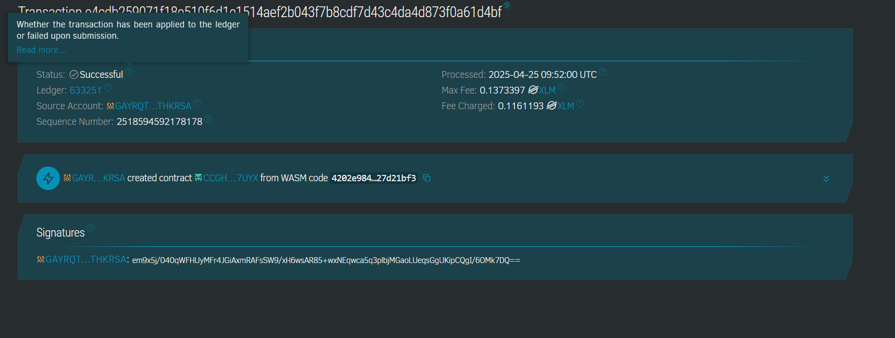

# Personal Finance Management App

## Project Description
The Personal Finance Management App enables users to track and manage their daily expenses directly on-chain using a lightweight smart contract. It allows users to categorize spending, record amounts, and retrieve their transaction history securely.

## contract address details:
CCGHP55B7FGLWTELEZJARHH5CGH7N5HKNM2OHGTTQHLNYMM3YLER7UYX

## Project Vision
To build a decentralized, transparent, and user-friendly financial tool that empowers individuals to manage their expenses and budgeting on the blockchain without relying on centralized apps or services.

## Key Features
- 📥 **Add Expense**: Log any transaction with a category and amount.
- 📊 **Retrieve Expenses**: Access transaction details by ID.
- 🔢 **Expense Count**: Get the total number of expenses recorded.
- ⏱️ **Timestamp Tracking**: Each entry includes a ledger timestamp for reference.

## Future Scope
- 🔐 User authentication for multi-user support.
- 📈 Budget planning and monthly summaries.
- 💡 AI-powered savings recommendations.
- 📱 Integration with web/mobile front-ends.
- 📤 Export data to CSV or analytics dashboards.

